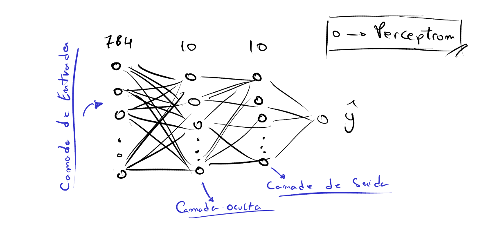

# Rede Neural Artificial do Zero com Numpy e Algebra Linear

Redes Neurais Artificiais são algorítimos computacionais inspirados no funcionamento do cerebro humano, em que sua menor estrutura é o perceptron, sua estrutura é simples, sendo composta por entradas que são multiplicadas por pesos (ganhos) e somado com número [vies (Bayas)], além disso o perceptron possui uma função de ativação, a figura abaixo mostra a estrutura de um perceptron.

